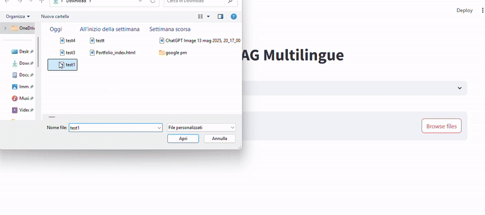

# Rag Images

Rag Images è un'applicazione che sfrutta tecniche di Retrieval-Augmented Generation (RAG) per analizzare immagini caricate, estrarre una descrizione testuale tramite BLIP, indicizzare testi con FAISS, e rispondere a domande relative all'immagine usando un modello LLM (es. llama2).


---

## Anteprima



---

## Funzionalità

- Caricamento di immagini e generazione automatica di descrizioni con il modello BLIP.
- Indicizzazione e ricerca di descrizioni testuali tramite FAISS per ottimizzare il contesto.
- Risposta a domande sull'immagine usando un modello LLM (es. llama2) tramite API locale.
- Supporto multilingua per domande e risposte.
- Interfaccia interattiva e semplice con Streamlit.

---

## Requisiti

- Python 3.8 o superiore
- streamlit
- pillow
- faiss-cpu
- sentence-transformers
- transformers
- torch
- requests

---

## Installazione

1. Clona il repository:

```bash
git clone https://github.com/tuo-username/rag-images.git
cd rag-images
Crea e attiva un ambiente virtuale:


python -m venv venv
source venv/bin/activate  # Windows: venv\Scripts\activate
Installa le dipendenze:


pip install -r requirements.txt
Configura eventuali variabili d'ambiente (se necessarie), ad esempio per la chiave API o endpoint personalizzati.

Uso
Avvia l'app:


streamlit run app.py
Carica un’immagine.

L’app genera automaticamente una descrizione.

Puoi porre domande sull’immagine e ricevere risposte basate sul contesto estratto e indicizzato.

Le risposte sono generate tramite modello LLM in streaming.

Struttura progetto
app.py: Streamlit UI e flusso principale.

models/blip_model.py: codice per estrazione descrizione immagine con BLIP.

models/vector_store.py: gestione FAISS (indicizzazione e ricerca).

models/gpt_model.py: chiamata API modello LLM per risposta in streaming.

Note
Il modello LLM (es. llama2) deve essere esposto in locale su http://localhost:11434.

FAISS mantiene un indice persistente in faiss_index.index e testi in documents.pkl.

Per multilingua, il prompt del sistema può essere adattato nel codice generate_response_stream.

Ottimizza il dataset pre-caricando testi descrittivi rilevanti per migliorare le risposte.

Licenza
Questo progetto è rilasciato sotto licenza MIT.

